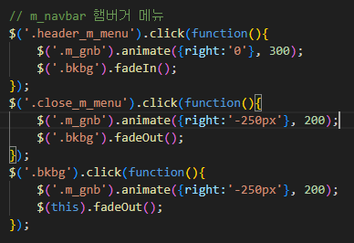

# PORTFOLIO_MERLOTLAB 💫
 

# 📖 Description
[메를로랩] 사이트를  리디자인 및 기능 구현 한 프로젝트입니다.
 

### 📌 개발 기간
2023.11.12 ~ 2023.11.30

### 📌 Stacks
#### [Environment]
VISUAL STUDIO CODE, GIT, GITHUB

#### [Development]
JavaScript, jQuery, slick-slider
 
 
# 🖥 화면 구성
#### [PC]

#### [Tablet]

#### [Mobile]

 

# 💥 오류 수정
## 1️⃣ mobile 버전 -> pc, tablet 버전 전환시, 헤더 메뉴가 오른쪽으로 치우침
 

#### ✔ WHY ?

##### -> 'nav' 태그가 2개 존재하고 있었음

 

#### ✔ HOW ?
nav 태그에 각각의 클래스명을 부여하여 구분해주었음
 
적용되어야 할 nav 태그만 호출

 

# ⭐ 기능 구현
## 1️⃣ draggable-slider

 

## 2️⃣ map api 가져오기

##### 1) kakao developers 회원가입
##### 2) API 사용하기 -> 애플리케이션 추가하기
##### 3) 카카오맵에서 제공하고 있는 코드에 발급받은 API 키 넣기 

